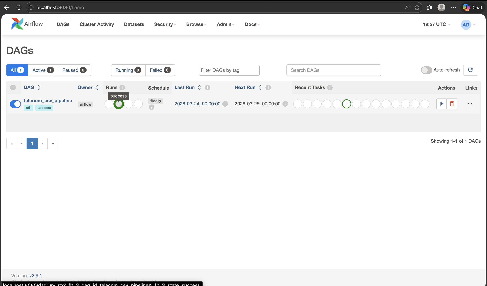
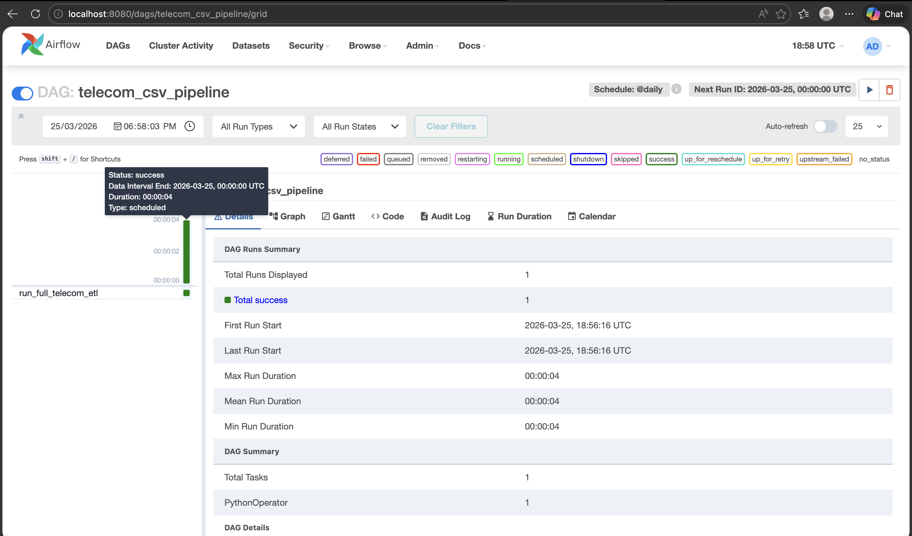
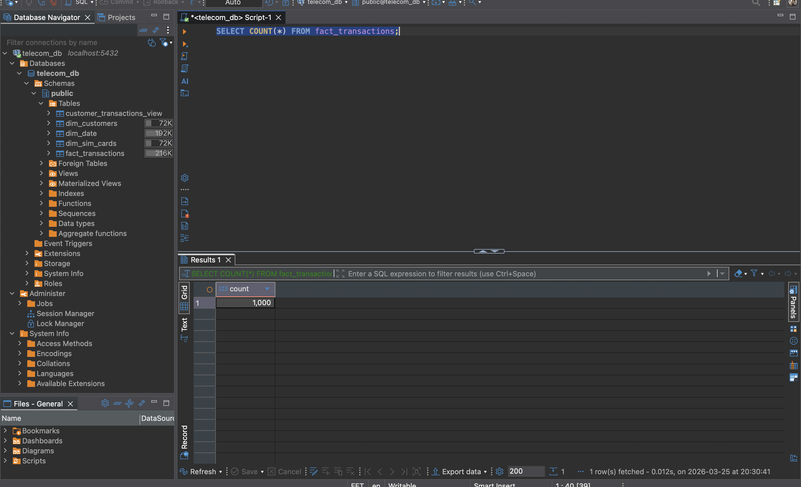
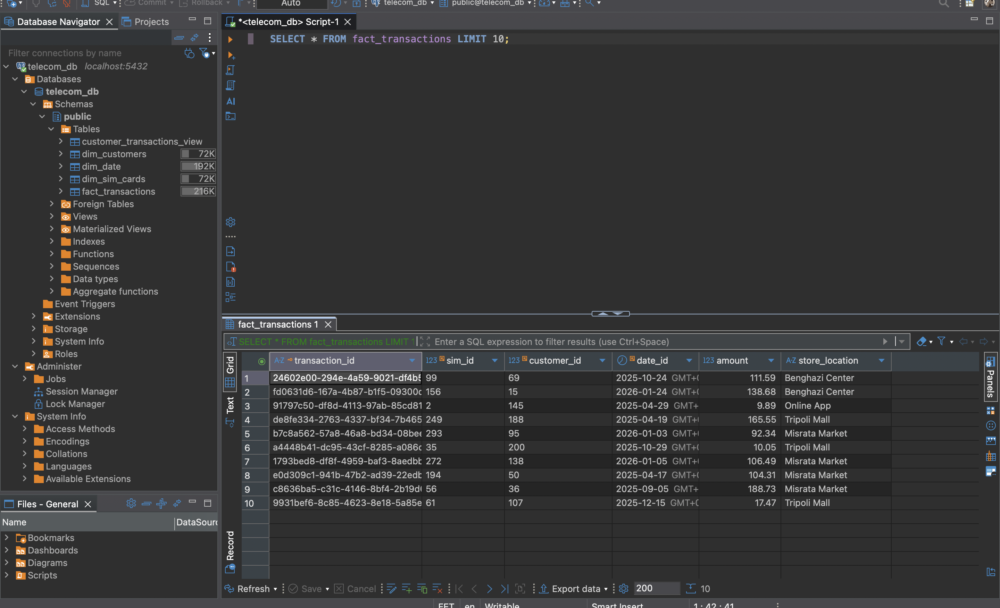
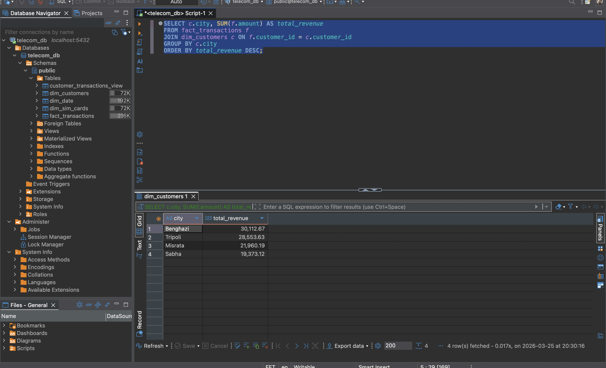
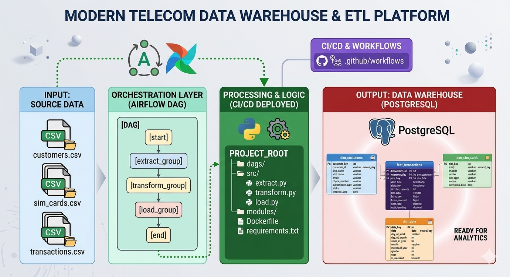

# Telecom Data Warehouse ETL Project

Production-ready Python ETL pipeline designed for a telecom data warehouse, fully Dockerized and orchestrated with Airflow. Built for high-quality, scalable, and maintainable data engineering workflows.

---

## Key Features & Highlights

- 📂 **Project Structure:** Clean modular design with `src/` for Python ETL scripts, `dags/` for Airflow orchestration, `data/` for raw CSVs, `tests/` for unit tests, and full CI/CD integration via GitHub Actions.

- 🔄 **ETL Pipeline:** Extract → Transform → Load workflow handling customers, SIM cards, and transactions data. Automated data cleaning, validation, and transformation with Python.

- ⭐ **Star Schema Data Warehouse:** Central fact table (`fact_transactions`) connected to dimension tables (`dim_customers`, `dim_sim_cards`, `dim_date`) for efficient analytics.

- 🚀 **Airflow Orchestration:** DAGs automate ETL runs, scheduling, and logging for reliable pipeline execution.

- 🐳 **Dockerized Environment:** Fully containerized pipeline for seamless deployment and environment consistency.

- 🧪 **Unit Testing & CI/CD:** Pytest coverage ensures data integrity; GitHub Actions pipeline handles linting, testing, and deployment.

- 💡 **Pro-Level Data Engineering Skills:** Demonstrates pipeline design, modular coding, orchestration, testing, and cloud-ready deployment.

---


## Project Structure & Visual Overview

<div align="center">
  <table>
    <tr>
      <td align="center">
        <br>
        <em>Airflow DAG overview and project folder structure</em>
      </td>
      <td align="center">
        <br>
        <em>ETL Pipeline Flow: Extract → Transform → Load (Successful Run)</em>
      </td>
    </tr>
    <tr>
      <td align="center">
        <br>
        <em>Fact Table Row Count: Ensures ETL loaded data</em>
      </td>
      <td align="center">
        <br>
        <em>Preview of `fact_transactions` data</em>
      </td>
    </tr>
    <tr>
      <td colspan="2" align="center">
        <br>
        <em>Analytics Example: Revenue by City</em>
      </td>
    </tr>
  </table>
</div>

---

## Platform Architecture Overview

<div align="center">
  <br>
  <em>High-level architecture of the Telecom Data Warehouse ETL pipeline</em>
</div>

---
## Outcome

A fully functional, professional-grade telecom data pipeline ready for production and scalable analytics. Perfect showcase for a **Data Engineer portfolio**.

---

## Tech Stack

- **Python 3.10** for ETL scripts  
- **Docker & Docker Compose** for environment consistency  
- **Apache Airflow** for orchestration  
- **PostgreSQL** for data warehouse  
- **GitHub Actions** for CI/CD  
- **Pytest** for unit testing  
- **CSV files** for raw telecom data  

---

## How to Run

```bash
# 1️⃣ Clone the repository
git clone https://github.com/ahmedmajid22/telecom-data-warehouse-etl.git
cd telecom-data-warehouse-etl

# 2️⃣ Build and start Docker containers
docker-compose up --build

# 3️⃣ Run Airflow webserver
docker-compose exec airflow airflow webserver

# 4️⃣ Run Airflow scheduler
docker-compose exec airflow airflow scheduler

# 5️⃣ Run tests
pytest tests/